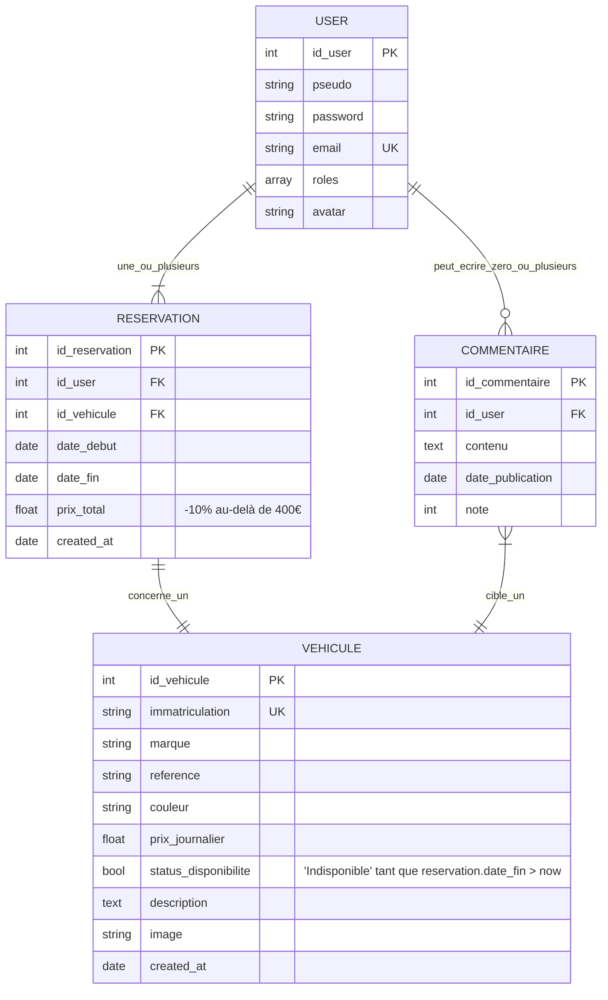
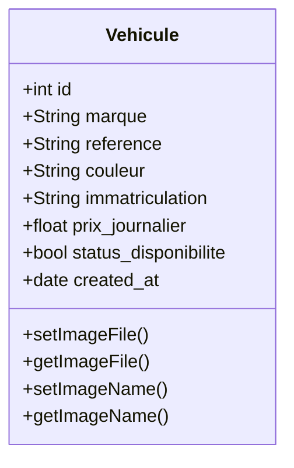
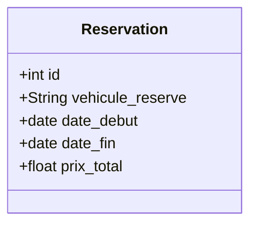
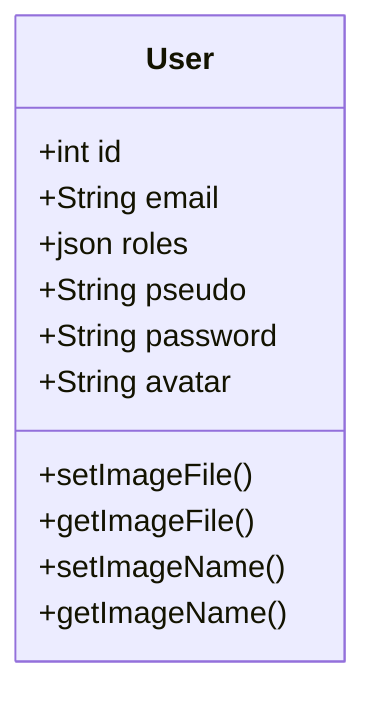

# Système de gestion de location de véhicules

## Sommaire
- [Système de gestion de location de véhicules](#système-de-gestion-de-location-de-véhicules)
  - [Sommaire](#sommaire)
  - [Context](#context)
- [Fonctionnalités requises (partie 1)](#fonctionnalités-requises-partie-1)
  - [Diagramme entité / relation](#diagramme-entité--relation)
  - [1. Gestion des Véhicules](#1-gestion-des-véhicules)
    - [Entité](#entité)
    - [Features](#features)
  - [2. Gestion des Réservations](#2-gestion-des-réservations)
    - [Entité](#entité-1)
    - [Features](#features-1)
  - [3. Gestion des Utilisateurs](#3-gestion-des-utilisateurs)
    - [Entité](#entité-2)
    - [Features](#features-2)
  - [4. Commentaire sur les véhicules](#4-commentaire-sur-les-véhicules)
    - [Entité](#entité-3)
    - [Features](#features-3)
  - [5. Interface Utilisateur](#5-interface-utilisateur)
- [Fonctionnalités requises (partie 2)](#fonctionnalités-requises-partie-2)
  - [Upload d'images](#upload-dimages)


## Context
Développer une application web en SYMFONY permettant la gestion complète d'une
agence de location de véhicules. Cette application devra offrir des fonctionnalités pour
administrer les véhicules disponibles, gérer les réservations, gérer les utilisateurs (avec
différents rôles) et permettre aux clients de laisser des commentaires sur les véhicules
qu'ils ont loués.

# Fonctionnalités requises (partie 1)

## Diagramme entité / relation


## 1. Gestion des Véhicules
### Entité

### Features
- [x] Ajouter, modifier, supprimer des véhicules.
- [x] Consulter la liste des véhicules disponibles avec leurs caractéristiques.
- [ ] Filtrer et rechercher les véhicules par marque, prix ou disponibilité.
___

## 2. Gestion des Réservations 
### Entité

### Features
- [ ] Permettre aux clients de réserver un véhicule.
- [x] Afficher les détails de la réservation.
- [ ] Annuler ou modifier une réservation avant le début de la période.
___

## 3. Gestion des Utilisateurs 
### Entité

### Features
- Différents rôles :
  - [ ] **`Administrateur`** : Accès complet pour gérer les véhicules, les utilisateurs et
les réservations.
  - [ ] **`Client`** : Réservation de véhicules et possibilité de laisser des commentaires.
- Fonctionnalités :
  - [ ] Inscription et connexion des utilisateurs.
  - [ ] Gestion des comptes utilisateurs (ajout, modification, suppression par
l'administrateur).
___

## 4. Commentaire sur les véhicules
### Entité

### Features
- [ ] Permettre aux clients de laisser un commentaire et une note sur un véhicule qu'ils
ont loué.
- [ ] Afficher les commentaires et la note moyenne pour chaque véhicule.
  
## 5. Interface Utilisateur
- [ ] Interface simple et conviviale.
- [ ] Tableau de bord pour chaque rôle, avec les fonctionnalités spécifiques.
- [ ] Pages publiques pour consulter les véhicules disponibles sans réservation.

# Fonctionnalités requises (partie 2)
- [ ] Afficher les commentaires et moyenne note dans le détail de chaque véhicule.
- [ ] Afficher le formulaire de commentaire uniquement si l’utilisateur a loué ce véhicule au moins
une fois.
- [ ] Vérifier, à chaque réservation, que la date de début est bien antérieure à la date de fin.
- [ ] Indiquer la disponibilité de chaque véhicule sur la page d’affichage des véhicules
- [ ] Assurer que le prix d’une location varie entre 100 et 500 euros.
- [ ] Rendre le statut "indisponible" non modifiable, même par l’administrateur, tant que la date de
fin de la réservation n’est pas atteinte.
- [ ] Gérer les exceptions liées à la manipulation des données, par exemple lors de la suppression d’un
véhicule associé à un commentaire.
- [x] Appliquer une réduction de 10 % sur le prix d’une location lorsque celui-ci atteint 400 €.
- [ ] Afficher, pour chaque véhicule (dans la liste ou dans son détail), le nombre total de réservations
effectuées.
- [x] Ajout de photos des véhicules : Permettre d’ajouter plusieurs images pour chaque véhicule.
- [ ] Affichage des véhicules similaires : Proposer des véhicules similaires lorsqu’un véhicule est
indisponible.
- [ ] Favoris : Permettre aux utilisateurs d'ajouter des véhicules en favoris pour les retrouver plus
facilement.

## Upload d'images
```pwsh
# Install dependency
composer require vich/uploader-bundle
```

```yml
# vich_uploader.yml 
mappings:
        vehicule_image:
            uri_prefix: /images/products
            upload_destination: '%kernel.project_dir%/public/images/products'
            namer: Vich\UploaderBundle\Naming\SmartUniqueNamer
```

```php
// Product.php 
namespace App\Entity;

use Doctrine\ORM\Mapping as ORM;
use Symfony\Component\HttpFoundation\File\File;
use Vich\UploaderBundle\Mapping\Annotation as Vich;

#[ORM\Entity]
#[Vich\Uploadable]
class Product
{
    #[ORM\Id]
    #[ORM\Column]
    #[ORM\GeneratedValue]
    private ?int $id = null;

    // NOTE: This is not a mapped field of entity metadata, just a simple property.
    #[Vich\UploadableField(mapping: 'products', fileNameProperty: 'imageName')]
    private ?File $imageFile = null;

    #[ORM\Column(nullable: true)]
    private ?string $imageName = null;

    #[ORM\Column(nullable: true)]
    private ?\DateTimeImmutable $updatedAt = null;

    /**
     * @param File|\Symfony\Component\HttpFoundation\File\UploadedFile|null $imageFile
     */
    public function setImageFile(?File $imageFile = null): void
    {
        $this->imageFile = $imageFile;

        if (null !== $imageFile) {
            // It is required that at least one field changes if you are using doctrine
            // otherwise the event listeners won't be called and the file is lost
            $this->updatedAt = new \DateTimeImmutable();
        }
    }

    public function getImageFile(): ?File
    {
        return $this->imageFile;
    }

    public function setImageName(?string $imageName): void
    {
        $this->imageName = $imageName;
    }

    public function getImageName(): ?string
    {
        return $this->imageName;
    }
}
```

```php
// ProductType.php
namespace App\Form;

use App\Entity\Product;
use App\Entity\Vehicule;
use Symfony\Component\OptionsResolver\OptionsResolver;
use Symfony\Component\Form\AbstractType;
use Vich\UploaderBundle\Form\Type\VichFileType;

class ProductType extends AbstractType
{
    public function buildForm(FormBuilderInterface $builder, array $options): void
    {
        $builder
            ->add('imageFile', VichFileType::class, [
                'mapped' => false,
                'label' => 'Image',
                'attr' => [
                    'placeholder' => 'Image du produit',
                    'class' => 'file-input',
                ],
                'required' => false,
            ])
        ;
    }

    public function configureOptions(OptionsResolver $resolver): void
    {
        $resolver->setDefaults([
            'data_class' => Product::class,
        ]);
    }
}

```

